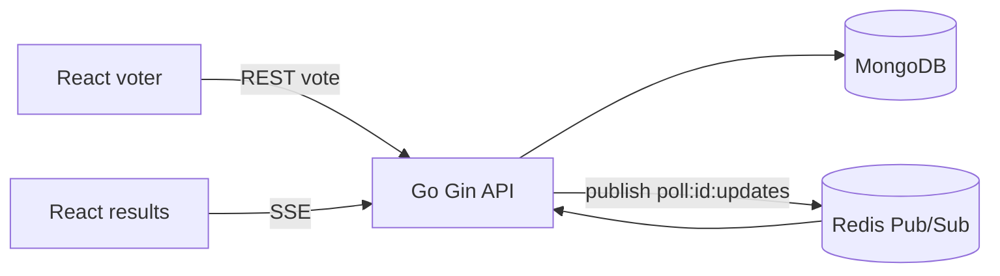

# PulseVote

PulseVote is a production-oriented live polling application for the GUVI Developer Internship assignment. It uses React/Vite, Go/Gin, MongoDB, Redis Pub/Sub, and Server-Sent Events to deliver the flow: create a poll, share a public URL, collect anonymous votes, and watch the results update live.

## Architecture



The API publishes a complete poll snapshot to `poll:{pollId}:updates` after a successful MongoDB vote. Each SSE connection subscribes to that Redis channel, so multiple API instances can receive and fan out the same event. The browser never uses interval polling.

## Features

- JWT signup/login, bcrypt password hashing, protected poll management
- Backend validation for questions, options, IDs, ownership, and votes
- MongoDB users, polls, and votes collections with unique email and voter indexes
- Anonymous public polls and one-vote-per-browser protection using a local voter ID plus MongoDB unique index
- Redis Pub/Sub to SSE live results, disconnect cleanup, and responsive reconnect behavior from EventSource
- Responsive dashboard, empty/loading/error states, copy-link action, and live percentage bars
- Poll lifecycle fields: active/closed/expired status, server-enforced expiry, anonymous/named voting mode, and owner close action
- Dashboard search and status filters, reusable poll templates, owner-only analytics data, and CSV result export

## Structure

- `backend/cmd/server`: process entrypoint
- `backend/internal/app`: Gin routes, validation, MongoDB access, auth, voting, and realtime subscriber
- `frontend/src`: React routes, UI, API client, and responsive styles

## Local setup

Prerequisites: Go 1.22+, Node 20+, Docker Desktop (or local MongoDB and Redis).

```bash
docker compose up -d mongo redis
copy backend\\.env.example backend\\.env
cd backend
go mod tidy
go test ./...
go run ./cmd/server
```

In another terminal:

```bash
cd frontend
copy .env.example .env
npm install
npm run dev
```

Open `http://localhost:5173`. The API health check is `http://localhost:8080/health`.

## Environment variables

Backend: `PORT`, `MONGO_URI`, `MONGO_DATABASE`, `REDIS_URL`, `JWT_SECRET`, and comma-separated `CORS_ORIGINS`. Frontend: `VITE_API_URL`. Never commit a real `.env` file.

## API overview

- `POST /api/auth/signup`, `POST /api/auth/login`, `GET /api/auth/me`
- `GET /api/polls`, `POST /api/polls`, `PUT /api/polls/:id`, `DELETE /api/polls/:id` (JWT required)
- `GET /api/polls/:id`, `GET /api/polls/:id/results`, `POST /api/polls/:id/vote`
- `POST /api/polls/:id/close`, `GET /api/polls/:id/analytics`, `GET /api/polls/:id/export?format=csv`
- `GET /api/templates`, `POST /api/polls/from-template`, `POST /api/auth/logout`
- `GET /api/polls/:id/stream` (SSE; public)

All JSON responses use `{success, data}` or `{success:false, error:{code,message}}`. Protected routes derive ownership from the verified JWT, never from frontend-supplied user IDs.

## Deployment

Create a MongoDB Atlas database and hosted Redis (Redis Cloud, Upstash, or equivalent). Deploy `backend` to Render, Railway, or Fly.io with the backend variables and a generated `JWT_SECRET`; set `CORS_ORIGINS` to the deployed frontend origin. Deploy `frontend` to Vercel/Netlify with `VITE_API_URL=https://your-api.example.com/api`. The API service must support long-lived HTTP connections for SSE and should not buffer responses.

## Testing and limitations

Run `go test ./...` for validation tests. The core vote path is designed for a single atomic application process and the unique MongoDB vote index prevents ordinary duplicate votes. A determined user can bypass browser identity by clearing storage; production systems may add account-based voting, IP/device risk scoring, or a Redis TTL rate limiter. Named voting is represented in the poll contract and should be paired with authenticated audience sessions before enabling it for sensitive polls. QR rendering, richer chart analytics, moderation, and refresh-token rotation are sensible next improvements.
